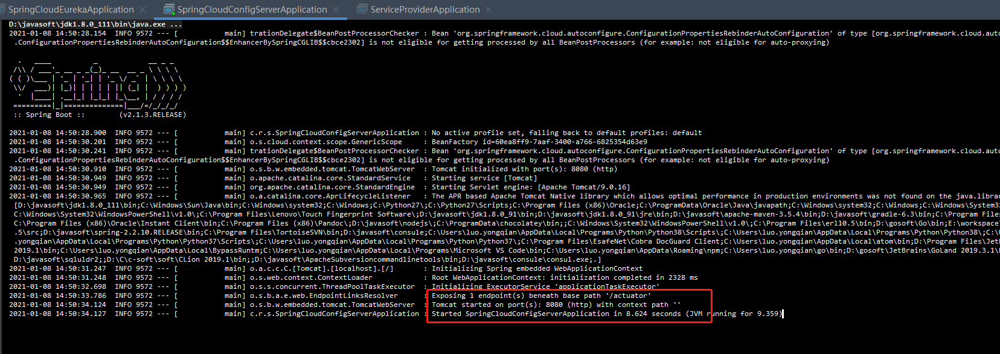
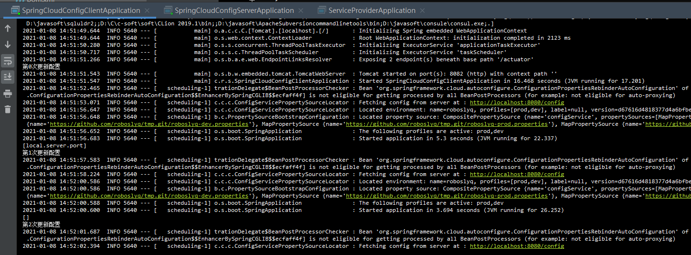

# Spring cloud learn 项目结构说明


## 测试步骤

### 服务测试

**启动注册中心**

> spring-cloud-eureka


**启动服务提供者**

> spring-cloud-server-demo


**启动服务消费者**

> spring-cloud-feign-client或者spring-cloud-hystrix或者spring-cloud-ribbon-client，这三个均是消费者，启动其中一个即可。我使用feign来做测试。


**界面测试**


> 上面请示经过流程是spring-cloud-feign-client -> spring-cloud-server-demo,并且依赖于spring-cloud-eureka服务注册发现


### 配置中心测试

**前提**

> 依赖于github仓库


**配置中心**

> spring-cloud-config-server



**配置消费**

> spring-cloud-config-client



**配置测试**


在github修改dev配置文件,修改后的值如下：


再访问页面


其中，@valueName是指下面这种代码变量,没有进行自动更新

> ```java
> @Value("${roboslyq.user.name}")
> private String userName;
> ```

evnName指下面这种从Enviroment中获取的变量

```java
	@Autowired
	Environment environment;

	@RequestMapping("/getUser")
	public String user() {
        String realTimeUserName = environment.getProperty("roboslyq.user.name");
		return "@valueName = "+userName+"<br/> envName = "+ realTimeUserName ;
	}
```

如果想要@valueName也更新，可以在类上加上@RefreshScope注解


加上之后再更新github中的配置，控制台日志如下：


页测试结果如下 ：

